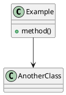

## What I do

- Create UML diagrams using PlantUML syntax
- Understand and interpret existing PlantUML diagrams
- Recommend the best diagram type for a given request
- Provide insightful tips on UML modeling best practices
- Fetch PlantUML documentation when needed

## Markdown Integration

When embedding PlantUML diagrams in markdown files, use fenced code blocks with the `plantuml` language identifier:



This syntax ensures:
- Proper syntax highlighting in markdown editors
- Correct rendering in GitHub/GitLab
- Clean integration with documentation systems

### IMPORTANT: Multi-line Strings

When you need to set a string on multiple lines in PlantUML, **do not insert an actual carriage return**. Instead, use the `\n` escape sequence:

```plantuml
component "This is\nmultiple lines" as MyComponent
```

Using `\n` ensures proper rendering in markdown files and avoids breaking the code block structure.

## Diagram Types I specialize in

| Diagram Type | Best For | PlantUML Syntax |
|--------------|----------|-----------------|
| Class Diagram | Show class structure, relationships, inheritance | `class`, `interface`, `extends`, `implements` |
| Sequence Diagram | Show object interactions over time | `participant`, `->`, `-->` |
| Object Diagram | Show instance relationships at a point in time | `object`, `==` |
| State Diagram | Show state transitions and behavior | `state`, `->`, `*` |
| Use Case Diagram | Show functional requirements | `usecase`, `actor`, `--` |
| Activity Diagram | Show business processes and workflows | `start`, `stop`, `->`, `fork` |
| Component Diagram | Show modular architecture | `component`, `interface`, `[--]` |

## PlantUML Documentation Resources

When I need to recall specific syntax, I can reference:

- **Sequence Diagrams**: https://plantuml.com/sequence-diagram
- **Use Case Diagrams**: https://plantuml.com/use-case-diagram
- **Class Diagrams**: https://plantuml.com/class-diagram
- **Activity Diagrams**: https://plantuml.com/activity-diagram-beta
- **Component Diagrams**: https://plantuml.com/component-diagram
- **State Diagrams**: https://plantuml.com/state-diagram
- **Object Diagrams**: https://plantuml.com/object-diagram
- **Standard Library**: https://plantuml.com/stdlib

## Best Practices

### Diagram Layout

**Prefer tall diagrams over wide diagrams.** When possible:
- Organize layouts to have greater height than width
- Use vertical arrangements rather than horizontal for simple class relations
- For inheritance with many subclasses, using horizontal arrows places subclasses in a vertical line (better readability)

Example preference:
```plantuml
' Good: vertical organization
ClassA -|> ClassB
ClassA -|> ClassC
ClassA -|> ClassD
```

### Class Diagrams
- Show only relevant classes (not every class in the project)
- Use meaningful relationship labels
- Group related classes in packages
- Show multiplicity when important

### Sequence Diagrams
- Keep the scope focused (one use case or feature)
- Use descriptive message names
- Show loops and conditions clearly
- Consider using "alt" for branching paths

### State Diagrams
- Identify all possible states
- Define clear transition triggers
- Consider initial and final states
- Show guard conditions when relevant

### Activity Diagrams
- Start with a clear entry point
- Use parallel branches for concurrent actions
- Include decision points clearly
- End with clear termination states

## When to use me

Use this skill when:
- You need to visualize class relationships in the codebase
- You want to document the flow of a feature or operation
- You need to show state transitions in a system
- You want to document component architecture
- You need to create use cases for a feature
- You want to understand or explain code structure visually

## Tips

- **Keep diagrams focused** - one diagram per concept
- **Prefer tall over wide** - organize layouts vertically when possible
- **Use labels generously** - clarify relationships and messages
- **Consider your audience** - developers vs stakeholders
- **Iterate** - start simple, add detail as needed